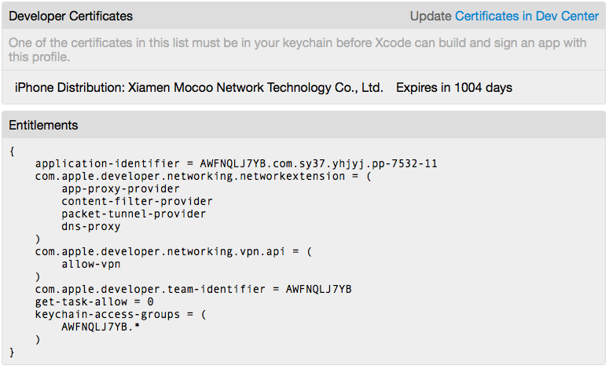

# Snail
防闪退工具

~~~
原理:通过拦截系统 http://ocsp.apple.com 请求实现防闪退
拦截测试:
设备安装完防闪退工具，启动app打开VPN,然后在safari浏览器中访问
http://ocsp.apple.com 如果页面显示 500 error说明拦截成功，否则没有成功拦截。
~~~

安装成功之后，在设置->通用->VPN选项就能够找到该VPN配置项。
启用该功能需要配套的证书权限，否则无法开启VPN功能，具体参阅上图。